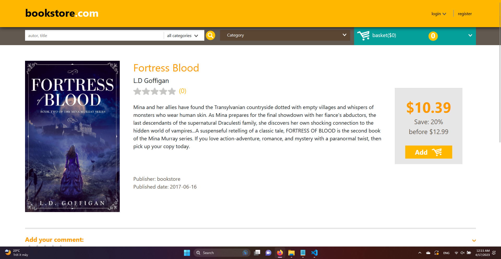

# BOOK STORE

Book store: https://lamnv-bookstore.netlify.app/

## Features
***
- Register
- Activation
- Forgot password
- Login 
- Edit personal infomation
- Browse for books
- Search for books
- View book details
- Add rating and comment
- Add book to cart and view shopping cart
- Checkout with stripe 
- View past orders

## Tech
***
Book store uses a number of open source projects to work properly:

- [VueJS](https://vuejs.org/) - HTML enhanced for web apps!
- [Django](https://www.djangoproject.com/) - Framework for backend
- [Django rest framework](https://www.django-rest-framework.org/) - Api 
- [Bootstrap-v5](https://getbootstrap.com/) - Great UI boilerplate for modern web apps
- [Font Awesome](https://fontawesome.com/) - Great icon application
- [Heroku](https://www.heroku.com/) - Hosting platform for backend 
- [Netlify](https://www.netlify.com/) - Hosting platform for frontend
- [Stripe](https://stripe.com/) - Checkout platform

## Image
***

